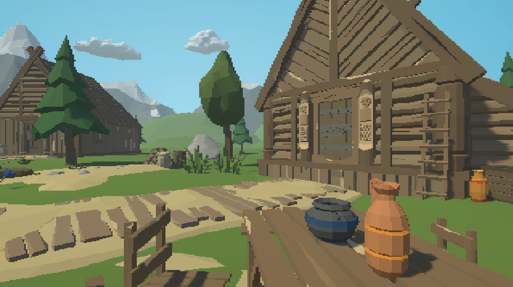
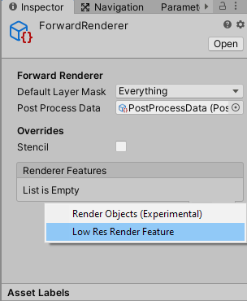
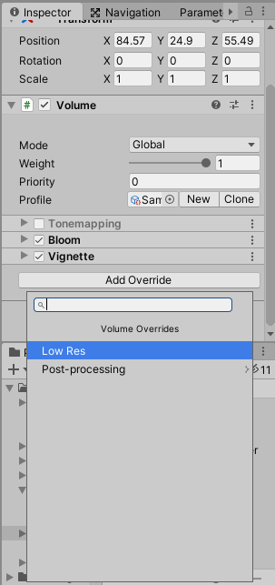

# LowRes
Low resolution effect for Unity URP PPv3 

Add LowRes RendererFeature to your forward renderer 

Add LowRes effect in post processing volume

Height - screen height in pixels, width depends on aspect ratio

You done

Scene from screenshot
https://assetstore.unity.com/packages/3d/environments/landscapes/rpg-poly-pack-lite-148410
